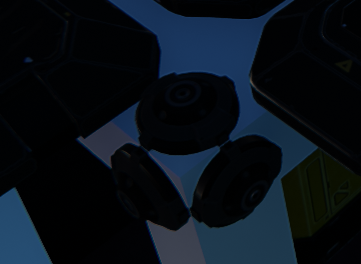

# DU-ELEVATOR

A Generic Elevator script for Dual universe

# Guilded Server (better than Discord)

You can join me on Guilded for help or suggestions or requests by following that link : https://guilded.jericho.dev

# Discord Server

You can join me on Discord for help or suggestions or requests by following that link : https://discord.gg/qkdjyqDZQZ

# Edit the code

# Installation

## Important notice

- the script was only tested on a remote control

## Links

You must link the following elements to the remote control (order doesn't matter, the script will detect them automatically):
- Link the core to the remote control
- Link the fuel tank to the remote control (only if you want to see the fuel gauge)
- Link the databank to the remote control (not required)
    - databank is used to store the initial position and orientation of the elevator. Using it will increase precision of the elevator.
    - storing bookmarks dynamically with the commands require the databank.

## Setup

- you need at least a vertical engine pointing the bottom
- you need at least one engine on each horizontal direction (forward, right, left, backward)
- you need at least 3 adjustors on each angles of the construct : (see picture below)
    - one pointing up (this one is used for autoroll and autopitch)
    - one pointing on one side (this one is used for autoyaw)
    - one pointing on the orther side of the angle (this one is used for autoyaw)
    - 

You may need to adjust the power depending on the weight of your construct and on the total weight you want to lift.

## Installation of the script

- copy the content of the config.json file and paste it on the remote control (right click on the remote control -> advanced -> paste lua configuration from clipboard)

## Lua parameters

- `DEBUG` : if set to true, the script will print debug messages in the chat
- `ShowParentingWidget` : if set to true, the script will display a widget showing the parenting of the elevator
- `ShowControlUnitWidget` : if set to true, the script will display the default control unit widget
- `YawSpeedFactor` : the speed multiplier for auto yaw.
- `StrafeSpeedFactor` : the speed multiplier when strafing. adjust it depending on how many engines you have on the sides
- `DisplayAtlasData` : show the Atlas widget with closest planet informations

## Usage

### Bookmarks

You can set bookmarks to save altitudes with a name. Edit the script and go to Unit > OnStart, you will see a Bookmark list (table) at the top of the script. You can edit the list to add your custom points. The first element will be used ad the base altitude when the elevator is landed on the floor.

It's also possible to use the command `save:<name>` in the chat to save the current position with the specified name and `delete` to delete the current selected bookmark. (see Chat Command section below)

Navigating using bookmarks (based on the default game key bindings):
- you can navigate in the list in the HUD with your keyboard keys arrows up and down
- using arrow up and down with Ctrl (or strg depending on the language of your keyboard) will move the selected bookmark up or down in the list
- pressing the key arrow right will start the travel to the selected bookmark

Current selected bookmark is displayed in blue, the current bookmark the elevator is going to is displayed in green.

### Chat Command

open the "lua" chat channel and type one of these commands :
- `goto:<altitude>` to go to the specified altitude with `<altitude>` the altitude in meters, if the altitude is missing or invalid, it will send you the `BaseAltitude`
- `save:<name>` to save the current position with `<name>` the name of the bookmark
- `delete` to delete the current selected bookmark

### Other keys

- Option 1 (default Alt+1): save the current position and orientation as initial values in the databank

# Customize the HUD

This is script is build to be customizable. A function rendering the HUD can be replaced by your own rendering to add informations on the HUD.

## How to customize the HUD

In Unit > OnStart, around line 28, you will fin a method name RENDER_HUD. This method is called every frame to render the HUD.

You can replace its content by your own code to render your own HUD.

The method has one argument named ElevatorData which is a table containing all the informations you need to render your HUD.

### ElevatorData structure
| Name | Type | Description |
| --- | --- | --- |
| ElevatorData.isBreaking | boolean | if the brakes a are enabled or not. |
| ElevatorData.verticalSpeed | number | the absolute vertical speed of the elevator in m/s. |
| ElevatorData.verticalSpeedSigned | number | the real vertical speed of the elevator in m/s. if <0 the elevator is falling. |
| ElevatorData.lateralSpeed | numver | the absolute lateral speed of the elevator in m/s. |
| ElevatorData.longitudinalSpeed | number | the absolute Longitudinal speed of the elevator in m/s. |
| ElevatorData.coreAltitude | number | the altitude from sea level returned by the core in meters. (warning: this altitude in space when far from planets is 0) |
| ElevatorData.altitude | number | computed altitude from the distance between the construct and the sea level of the closest planet. (not 0 when in space) |
| ElevatorData.atmosphereDistance | number | computed distance from the construct to the atmosphere of the closest planet |
| ElevatorData.atmosphereAltitude | number | computed altitude of the atmosphere of the closest planet |
| ElevatorData.atmoMaxSpeed | number | the maximum speed of the elevator in m/s when in atmosphere. (anti burn security) |
| ElevatorData.currentMaxSpeed | number | the maximum speed of the elevator in m/s. (50km/h in space) |
| ElevatorData.planetData | table | Atlas Data of the closest planet. See atlas in game file for the structure (Game Directory\data\lua\atlas.lua) |

# Coming Soon

- screen support to display position informations and bookmarks and navigate by clicking on it
- manual control mode to be able to control the elevator with the keyboard (like a normal ship)
- replacing altitude bookmarks by positions to be able to use the elevator as an autopilot browsing threw waypoints
- ~~support for emitter to be able to send a signal to a specific channel to close a door to lock the elevator in position~~ This feature will not be done but replaced by a more generic system to manage several events than can be used to interact with any thing in the construct (doors, lights, etc...) or on another construct (like a door on the floor) via an emitter.

# Support or donation

if you like it, 
